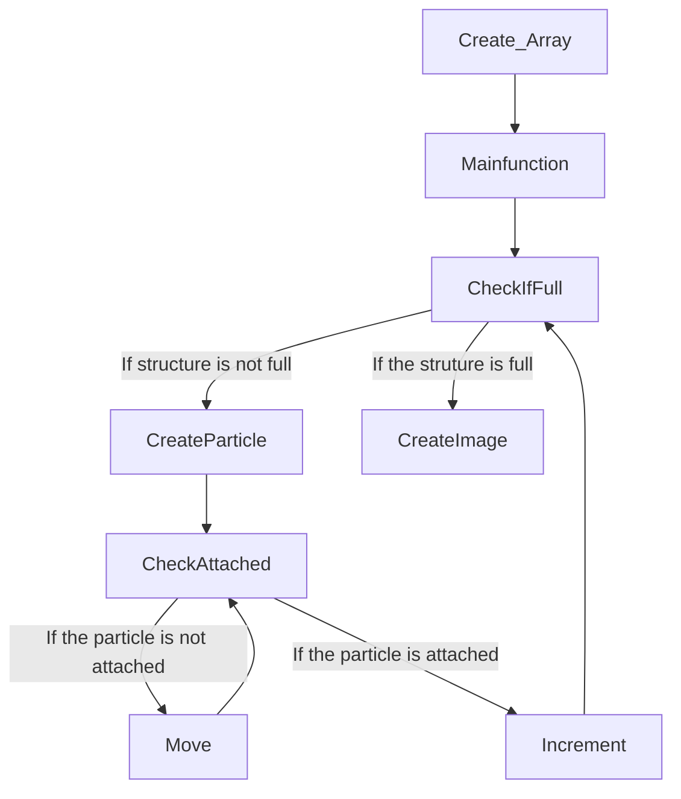

---
    Author: Mateo Cacheiro
    Topic: Diffusion Limited Aggregation Project
    Course: TN Tech PHYS4130
    Term: Spring 2025
---

## The Writeup

Typically, we can classify objects based on their dimension. For example, lines are one-dimensional, planes are two-dimensional, and cubes are three-dimensional. Based on these examples, it seems impossible for something to have a non-integer dimension. After all, you can't move in 1.5 directions, so how could a non-integer dimension have any meaning? 

This conflict only exists when "dimension" is used to describe the Euclidian topological space. By looking beyond the traditional definition of dimension, we can dive into an entire field of math known as "fractals." Fractals are structures that exhibit an abnormal feature. At first glance, fractals follow the conventional idea of dimension. However, by defining a quantity known as the **Fractal Dimension**, we observe that it is possible for a shape to have a non-integer dimension. This value represents how complicated or rough a shape is. Practically, the fractal dimension can model how windy a road is or convey the jaggedness of any other natural shape with sharp turns or curves. 

In this project, the fractal dimension models the infill of diffusion-limited aggregations (DLAs). DLAs are complex structures produced with computational methods that model phenomena in nature. In physics, DLAs can model crystal growth, among other complex structures. The code for this project uses a taxicab geometry and a random walk to generate aggregates with up to 1.5E5 particles. 

<figure>
  
  <figcaption>Largest Aggregate made with code. 150K Particles.</figcaption>
</figure>

&nbsp;
 
   

The code uses multiple libraries, including Matplotlib, Numpy, Math, and Numba. Using functions from each of these libraries and the following algorithm, 100K Particle DLA structures can be formed in around 80 seconds. 

&nbsp;

Beyond the simple aggregation, a stickiness factor (0.01,1) was implemented into the program, altering the fractal dimension of the structures produced. Historically, the program produced structures with a fractal dimension of 1.65; however, by implementing the Stickiness factor, the dimension reached values of 1.95. The following images are 10K particle structures produced with different stickiness factors.

&nbsp;
 

&nbsp;
 

&nbsp;

<figure>
  
  <figcaption>Largest fractal dimension made with code. 10K Particles S=0.01 FD=1.95.</figcaption>
</figure>

&nbsp;
 

&nbsp;
 

&nbsp;
 
<figure>
  
  <figcaption>10K Particles S=0.1 FD=1.81.</figcaption>
</figure>

&nbsp;
 

&nbsp;
 

&nbsp;
 
<figure>
  
  <figcaption>10K Particles S=0.5 FD=1.71</figcaption>
</figure>

&nbsp;
 

&nbsp;
 

&nbsp;
 
<figure>
  
  <figcaption>10K Particles. S=0.99, FD=1.66</figcaption>
</figure>

&nbsp;
 

&nbsp;
 

&nbsp;
 

&nbsp;
 

<figure>
  
  <figcaption>Link to the graph of stickness vs. fractal dimension. As stickiness approaches 1, FD approaches 1.66. As stickiness approaches 0, FD approaches 2.</figcaption>
</figure>

&nbsp;
 

&nbsp;
 

&nbsp;
 
The pictures directory contains 100+ images with different settings and features. I will include some of my favorites bellow:

&nbsp;
 

&nbsp;
 

&nbsp;
 
<figure>
  
  <figcaption>50K particle structure. includes color code 1+N/50K. </figcaption>
</figure>

&nbsp;
 

&nbsp;
 

&nbsp;
 

<figure>
  
  <figcaption>The first 100K particle structure generated. </figcaption>
</figure>

&nbsp;
 

&nbsp;
 

&nbsp;
 

<figure>
  
  <figcaption>50K particle structure. S=0.1. FD=1.77. </figcaption>
</figure>

&nbsp;
 

&nbsp;
 

&nbsp;
 

> [!NOTE]
> I tried hard to figure out how to make an animation of my structure forming. My best idea was to create an image every 1000P for a 100KP structure, then turn those images into a gif. Unfortunately, I couldn't get the CreateImage function to work within a number.jit function.
>I also never managed to find a way to produce a graph with the fractal dimension as a function of the radius. However, I have produced enough of these structures now to know the fractal >dimension will always stay around 1.65 for structures over 10K particles. When N<10K, it seems to be a wider variation, but the value is still centered around 1.65.

> [!NOTE]
> Overall, I think this is what you hoped the writeup would look like, but I am unsure. I could write more about my specific algorithm, but I found nothing explicitly asking for that in the assignment. If I am misunderstanding what the writeup should be, please let me know. 

### Attribution
[1] https://math.bu.edu/DYSYS/chaos-game/node6.html

[2] https://en.wikipedia.org/wiki/Topological_space

[3] https://u.cs.biu.ac.il/~megereli/final_topology.pdf

[4] https://en.wikipedia.org/wiki/Metric_space

[5] https://www.quora.com/What-exactly-is-topological-dimension-and-how-does-it-relate-to-fractal-dimension

[6] https://journals.aps.org/prl/abstract/10.1103/PhysRevLett.47.1400

[7] https://www.youtube.com/watch?v=gB9n2gHsHN4&list=LL&ab_channel=3Blue1Brown

[8] https://www.youtube.com/watch?v=RFMZZ4pPKlk&list=LL&index=2&ab_channel=AshleyMills

[9] https://phas.ubc.ca/~berciu/TEACHING/PHYS349/DLA.pdf

[10] https://en.wikipedia.org/wiki/Lebesgue_covering_dimension

### Timekeeping
I have spent between 40 and 50 hours on this assignment since Jan 28.

### Languages, Libraries, Lessons Learned
 1. What language did you use for your submission? Is it the same one you started using? If not, why'd you change?
    I used Python for this program. Its the language I used from the start and I used it because it seems to be the most approachable. While I know a limited amount of C++, python seems to make a lot of things much easier. Overall, the support for python I found on the internet was very helpful so it encouraged me to continue working with the language. 
 2. What libraries did you use in your submission? Were any of them remarkable? Great to use, super annoying to use, etc?
    I used Numpy, Random, Matplotlib, math, and PIL. I wouldn't call any of them remarkable though. If anything Random made my life terrible. I used a command on the internet from one of the links you provided me via email and found a way to determine that the randint() function was extremly slow. 

