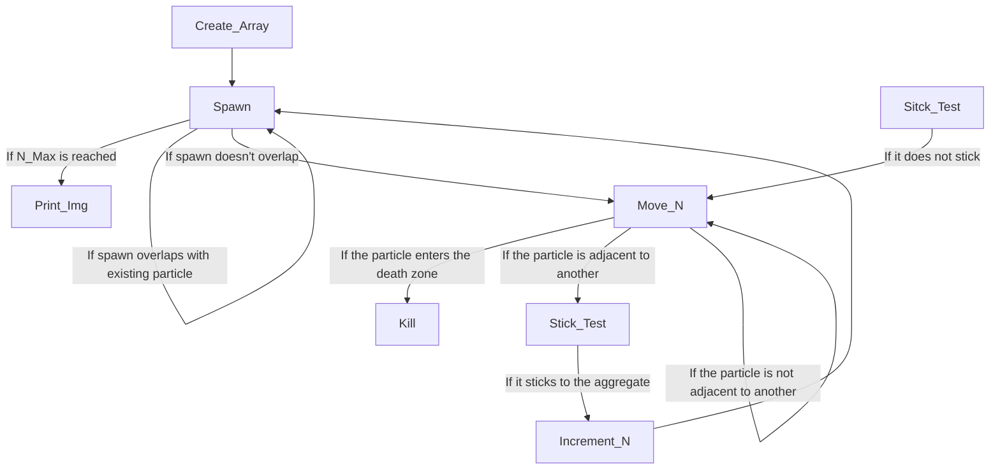

## WRITEUP

## QUESTIONS:
1. To my understanding, topological dimension is simply the
physical dimesions of a space, like 3-D for the physical world.
Capacity dimension is generally used to describe how complex the
fractal appears, with a higher capacity dimension meaning a more
branching fractal.

2. I can with varying degrees of success; I regularly get a
capacity dimension of between 1.6 and 1.8 when testing with
different numbers of particles.

3. Unfortunately, I think my code doesn't do the stickiness
correctly and I haven't figured out the issue. It seems as though
the capacity dimension increases with stickiness with my testing,
which isn't what I would expect to happen. I would expect that
the fractal would get more dense with lesser stickiness, which
would imply a higher capacity dimension.

## ATTRIBUTION:
I tried to avoid asking the others for help with this in an attempt
to better learn the material. I used several websites, including mostly
sites like stack exchange and geeksforgeeks, but didn't use any AI.

## TIMEKEEPING:
I probably spent around 15 hours on this assignment actually coding, but
25+ including simulation time

## LANGUAGES, LIBRARIES, LESSONS LEARNED:
1. I used python and stuck to it.

2. I used numpy, random, matplotlib.pyplot, and time. All of them were
easy to use.

## IMPORTANT NOTES AND IMAGES:
When doing this assignment, I decided early on that I wanted to make
it so that the particles can move to any spot adjacent to it, diagonals
included. This results in 8 potential spots for the particle to move. I
did this because it made the most sense to me physically, though I am
aware that technically the movements aren't weighted properly. I was
also unable to get the animations to work... like at all. I tried many
ways of doing it, but integrating it into the code that I already made
proved to be too difficult for me to do alone (without major sleep 
depravation). I also was unable to finish the plot of the fractal
dimension as a function of radius; I have an idea for how I would do
this, but I ran out of time. 

I produced some pretty images, though. Figure_1 shows a 10000 particle 
plot, with stickiness 1, and Figure_2 shows the same but with stickiness 
0.5. Figure_1 has a capacity dimension of 1.74 and Figure_2 has a
capacity dimension of 1.67. These capacity dimensions are calculated
seperately in Jupyter Notebooks, and I used this to construct a chart of
all the capacity dimensions of N=3000 with different stickinesses, as
shown in Figure_3. Yes, I know it was made in excel instead of python,
but it basically looks the same and I felt more comfortable making it 
there.

<figure>
  
    <figcaption>Aggregate of N=10000 with S=1</figcaption>
</figure>

&nbsp;
 

<figure>
  
    <figcaption>Aggregate of N=10000 with S=0.5</figcaption>
</figure>

&nbsp;
 

<figure>
  
    <figcaption>Chart of capacity dimension vs. stickiness</figcaption>
</figure>

&nbsp;
 

Penultimately, as show that not all of my efforts were in vain, Figure_4 shows
what happens if I employ seperate quadrants with different spawn and death 
radii. Specifically, it shows when there are 20 quadrants (I'm aware that 
they are by definition not quadrants anymore, but I find it humourous so 
I am going to keep going with that). With this many quadrants, the
simulation was much faster but broke the capacity dimension, so I had
to scrap the idea.

<figure>
  
    <figcaption>Aggregate of N=50000 with 20 quadrants</figcaption>
</figure>

&nbsp;
 

Finally, below is a diagram describing that describes what my code does
in it's standard form, ignoring the quadrants.

