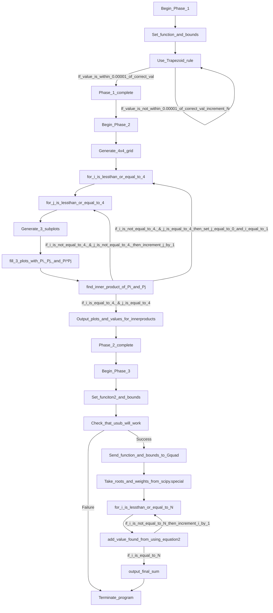

---
    Author: Mateo Cacheiro
    Topic: Numeric Integration Project
    Course: TN Tech PHYS4130
    Term: Spring 2025
---

## The Writeup
   
The program.py file contains an algorithm that completes three tasks and includes a variety of functions that can be used for different forms of Riemann sums. The program begins with an algorithm that uses a trapezoid rule to compute the following integral.

$$
	I = \int_0^2 \mathrm{d}x\, \sin^2\left(\sqrt{100x}\right)     (1)
$$

> [!NOTE]
> The function can easily be changed by altering what the function titled $N^2$ returns in line 10. The limits of integration can be adjusted by adjusting the values of a and b in line 134. 

The program will loop and compute the integral of the function using $N^2$ intervals until the value of the calculated sum is accurate to the 0.000001 place. The program will list the calculated sum and error for each loop.

After completing the final trapezoid Riemann sum, the program will use the Legendre Polynomials in the Scipy.special Library to generate a figure and confirm that the first four are orthogonal. Line 147 uses the numpy function linscape to generate a list of 10000 evenly spaced numbers between -1 and 1. This task generates the domain that will be used for the generated plots. Using the gridspec tool from Matplotlib.pyplots, a 4x4 table that can hold graphics is generated. Within each cell of this table, the subplots function creates three subplots. The first two subplots in each are used to display the Legendre Polynomial, that is, the degree of the row and column, respectively. The last subplot is then used to plot their product. For each of these plots, the domain created by the linscape function is used to calculate the x values. After the product plot is created, the trapezoid rule is used to find the integral of the product from -1 to 1. Each sum is stored in a 4x4 array. If the found value is within 0.00001 of 0 of 1, the value is rounded to make the output more meaningful. The final step of this program section is to output the plots and array of inner products. 

<figure>
  
  <figcaption>figure containing the plots of the first four Legendre Polynomials and their products. </figcaption>
</figure>

&nbsp;
 

&nbsp;
 

&nbsp;
 

The final section of the program uses an alternate method for numeric integration called Gaussian Quadrature. This method uses the roots of a polynomial to determine the points of a function that contribute most to the integral. Luckily, the scipy.special library contains the values for these roots and weights, so the algorithm does not need additional steps to obtain them. Unfortunately, the Gaussian Quadrature method only works for integrals with upper and lower bounds of 1 and -1. Therefore, a u-substitution is required for a function without these bounds. 

> [!NOTE]
> The program's default function is again the function (insert using latex); however, this can easily be changed by altering what the function titled "function2" returns in line 18. The limits of integration can be adjusted by adjusting the values of a1 and b2 in line 170.  

Before the integral of the function is calculated, the program ensures that the u-substitution correctly maps [a,b] to [-1,1]. Following this check, the function, its bounds, and the number of intervals are sent to the function that completes the Gaussian Quadrature ("Gquad"). The Gquad function finds the Sum of each interval using the following equation:

$$
    \int_{-1}^{1} \mathrm{d}x\, f(x) \approx \sum_{i=1}^N c_{N,i} f\left(x_{N,i}\right)        (2)
$$

After the Sum is found, the function implements the du correction factor that occurs when swapping dx for du. Lastly, the final value is sent back to the main program and outputted for the user.

> [!NOTE]
> I have not officially determined the time taken to find all the sums using the program's default function; However, the time taken for the entire program is <1s.
> Another important thing to note is that using Gaussian quadrature with only 12 intervals outputs a value with a similar error to a trapezoid Riemann with 8000+ intervals. This means that Gaussian quadrature converges with much fewer intervals and thus calls the function significantly less than any other Riemann approximation method.  

> [!NOTE]
> I have not been able to attempt any extensions for this project. 

### Attribution
[1] https://matplotlib.org/stable/gallery/subplots_axes_and_figures/subplots_demo.html 

[2] https://stackoverflow.com/questions/34933905/adding-subplots-to-a-subplot

This project did not require any significant searching on the internet for help or troubleshooting. The process was relatively straight forward and all sources beyond the above two were only used for help with syntax. 

### Timekeeping
I have spent between 15 to 20 hours on the entire project.

### Languages, Libraries, Lessons Learned
 1. What language did you use for your submission? Is it the same one you started using? If not, why'd you change?
    I chose to use python for this project. My choice was motivated by the Jupyter notebook activities assigned at the beginning of this project. The notebooks guided me through the process of making a grouping of functions that complete different versions of Riemann Sums. While only one of these functions is called in the main program they helped me learn to use the python language to create a numeric integration algorithm.  
 2. What libraries did you use in your submission? Were any of them remarkable? Great to use, super annoying to use, etc?
    I used Numpy, Matplotlib, and Scipy. Among these, Scipy.special was incredibly useful. This library contains functions that allow me to easily call the Legendre Polynomials. In addition the library let> [!NOTE]
>  me avoid the calculation of the roots and weights of the Legendre polynomials. Matplotlib was also very useful to create multiple subplots using the functions in scipy.special. 
