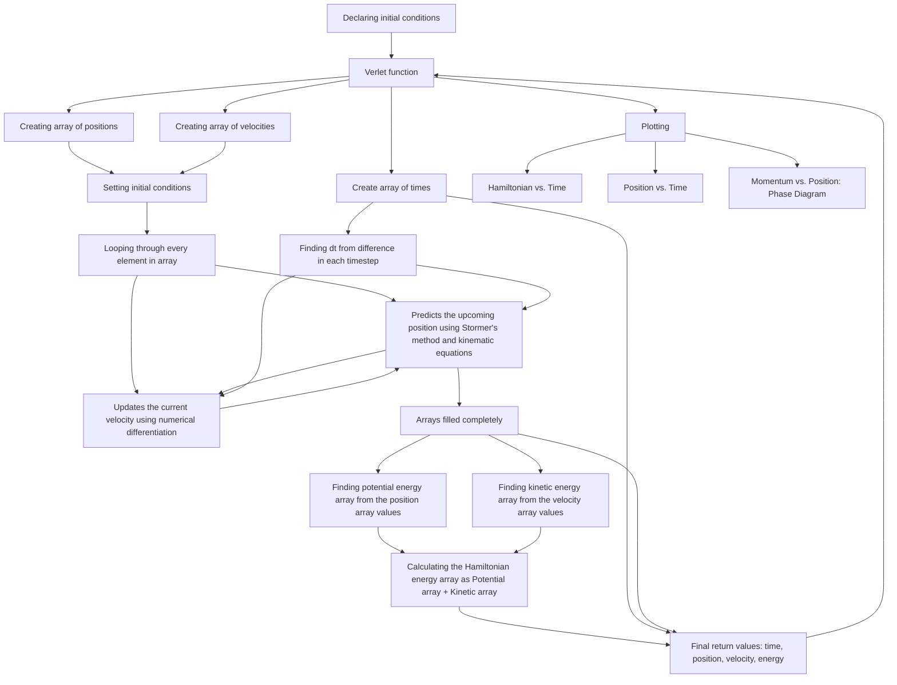

---
    Author: Ethan White
    Project: Project 4, Differential Equations Solvers
    Date: 4/20/2025
    Class: PHYS 4130, Spring 2025
---

# Introduction

Ordinary differential equations are one of the most important concepts in physics. It would help, then, to understand how to model these objects computationally. In the previous project 4 notebooks, Euler's method and Runge-Kutta, order 2 (RK2), were explored. In this project, RK4(5) is explored, as well as a linear-multistep algorithm called Adams' backward differentiation formula (Adams-BDF) method. Both of these non-energy-conserving methods were utilized from the SciPy.integrate library. Since, in physics, we also want to conserve energy, symplectic integrators are useful to look at. Verlet integration was explored in this project as well using the Stormer method and some useful numerical differentiation facts. 

> [!IMPORTANT]
> A symplectic integrator preserves energy. This means that the change in the Hamiltonian (total energy) over each time step does not change. You can see if an integrator is symplectic by just plotting the hamiltonian vs time or checking if the resulting phase diagram remains a constant shape over long time periods.

### Verlet Integration

A verlet integration function was created that follows this mermaid diagram using the Stormer method. It is roughly as follows:

$$
x_{n+1}=2x_n-x_{n-1}+a_n\Delta t^2
$$

where $a_n$ is acceleration at the point $n$. In my program, this acceleration was computed using Kinematics/Hooke's law (with a dampening parameter $\beta$) and by updating velocities at the point $n$ by computing the upcoming position and previous position and using a numerical differentiation technique at that point to get the velocity:

$$
\frac{dx}{dt}=\frac{x_{n+1}-x_{n-1}}{2\Delta t}
\frac{d^2x}{dt^2}=a_n=\frac{-kx-v\beta}{m}
$$

So, for example, for iteration i = 1, the position at i = 2 will be calculated first from the previous' positions velocity (i = 0) as an input for our acceleration. After the position at i = 2 is calculated, the numerical differentiation technique is deployed for the velocity at the current position i = 1. The loop continues on until every array element is filled.

## Results (varying the damping parameter while using our Verlet integrator)

<figure align="center">
  
  <figcaption align="center">[Figure 1] Plot of varying dampening parameters' affect on position vs time, going from 0 to 1.0. Obviously, as dampening parameter increases, the amplitude of the wave decreases over time faster as well, whereas if there is no dampening, then the amplitude just doesn't decrease (blue wave). </figcaption>
</figure>

<figure align="center">
  
  <figcaption align="center">[Figure 2] Plot of varying dampening parameters' affect on hamiltonian vs time, going from 0 to 1.0. Since the hamiltonian isn't even dependent on the dampening parameter, it's no surprise that energy is lost from the system, so the Hamiltonian is not constant with a non-zero dampening parameter. Ofcourse, with higher dampening parameter, the energy loss is faster. </figcaption>
</figure>

<figure align="center">
  
  <figcaption align="center">[Figure 3] Plot of varying dampening parameters' affect on the phase space diagram, going from 0 to 1.0. For nonzero dampening parameters, the resulting shape is a spiral inwards since the velocity is decreasing disproportionaly faster than the position. The resulting spiral goes to the center much faster for higher dampening parameters. </figcaption>
</figure>

## Results (different solvers and their respective phase diagrams, hamiltonian plots, and position plots)

<figure align="center">
  
  <figcaption align="center">[Figure 4] Plot of Verlet integration, RK4(5), and Adam's ODE methods' position plots, without dampening. RK4(5) and the Verlet integrator stayed very close in approximation with eachother, but there was a slight phase shift over a long period of time. The Adams' solver actually increased the amplitude of the wave over long periods of time. </figcaption>
</figure>

<figure align="center">
  
  <figcaption align="center">[Figure 5] Plot of Verlet integration, RK4(5), and Adam's ODE methods' hamiltonian plots, without dampening. As expected, the Verlet solver method remained constant, so energy was not lost out of the system. The RK4(5) method lost energy slowly (not symplectic). The Adams' method did some crazy, non-sinusoidal, non-linear, non-quadratic funky stuff that I can't really conceptualize. This erratic behaviour is why I chose this solver method-- I thought the resulting phase diagram would be cool. </figcaption>
</figure>

<figure align="center">
  
  <figcaption align="center">[Figure 6] Plot of Verlet integration, RK4(5), and Adam's ODE methods' phase space diagrams, without dampening. The Adams' method slowly went further and further away from the center of the Verlet integrator circle. The RK4(5) method's phase diagram stayed close but also diverged from the Verlet method's phase diagram.</figcaption>
</figure>

## Extensions

### Attribution

[1] I did look at Mateo's code when I got stuck on my ODE function for the RK4(5) since I didn't know how the return values worked. 

[2] https://scicomp.stackexchange.com/questions/8393/confusion-regarding-the-adam-moulton-and-backwards-differentiation-formula-bdf

[3] https://en.wikipedia.org/wiki/Verlet_integration

[4] https://docs.scipy.org/doc/scipy/reference/generated/scipy.integrate.solve_ivp.html

[5] https://docs.scipy.org/doc/scipy/reference/integrate.html (used towards looking at other SciPy integrators)

### Timekeeping

  I spent probably about 20 hours on this project, with 2-3 of which being the writeup. The most time was spent troubleshooting my Verlet solver and understanding how to use the solve_ivp function in the scipyintegrate library. 

### Languages, Libraries, and Lessons Learned

1. What language did you use for your submission? Is it the same one you started using? If not, why'd you change?

  I, once again, prioritized using Python since that's what I have done with everything else in the class. :P
  
2. What libraries did you use in your submission? Were any of them remarkable? Great to use, super annoying to use, etc?

  I used the Python libraries numpy and math for array/math things, matplotlib.pyplot for plotting, and the scipyintegrate library for the solve_ivp function/different methods of solution.
