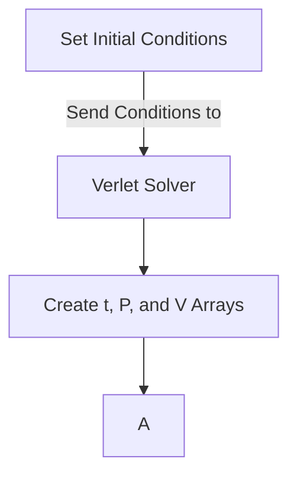

---
    Author: Mateo Cacheiro
    Topic: ODEs
    Course: TN Tech PHYS4130
    Term: Spring 2025
---

## The Writeup

In the previous python notebooks I created and implemented Euler and low order Runga Kutta numerical ODE solvers. While both of there integrators are easy to implement and understand, they are both low order and have large error. One source of error for these solvers is that they are both non-sympletic.
> [!NOTE]
> Sympletic integrators are numerical ODE solvers that conserve total energy.
>
> $$\Delta(T+U)=0$$

<figure align="center">
  
  <figcaption align="center">Plot of Position vs time for a SHO using the verlet integrator.</figcaption>
</figure>

&nbsp;
 
   

### Attribution
[1] https://en.wikipedia.org/wiki/Harmonic_oscillator

[2] https://www.algorithm-archive.org/contents/verlet_integration/verlet_integration.html

[3] https://en.wikipedia.org/wiki/Verlet_integration

[4] https://docs.scipy.org/doc/scipy/reference/integrate.html

[5] Google AI overview was briefly used to help with syntax and formating when troubleshooting issues with Scipy integrators. the following was entered into the google searchbar: "scipy rk45 with harmonic oscillator"

### Timekeeping
I have spent between 10 and 20 hours on this assignment.

### Languages, Libraries, Lessons Learned
 1. What language did you use for your submission? Is it the same one you started using? If not, why'd you change?

    I used Python for this program The overall idea of the project was very approachable considering the support provided by the jupyter notebooks assigned prior to the project. After learning to make ODE solvers in the notebook activities I was able to quickly transfer into the project. 
 2. What libraries did you use in your submission? Were any of them remarkable? Great to use, super annoying to use, etc?

     I used the Numpy library and solve_ivp from the scipy library to numerically solve the Simple harmonic Oscilator ODE. Once the ODE was solved I used the pylab library to generate plots of the solutions and features about the solutions. I also used pylab to turn those plots into saved images. After creating the images I removed those lines of code to limit the continual creation of images every time the code is run. At first I had a lot of trouble using the RK integrators from scipy because I didn't understand how to properly set up and send a second order ODE to the "solve_ivp". I also didn't understand that RK45 and RK23 were settings in the "solve_ivp" function rather than their own functions [5]. Upon a google search "AI Overview" gave me a much better explaination on how to use the RK45 and RK23 integrators than the Scipy reference material. The Scipy reference material was very abstract and didn't give any real instruction on how to use the integrators (This was kinda annoying).   
