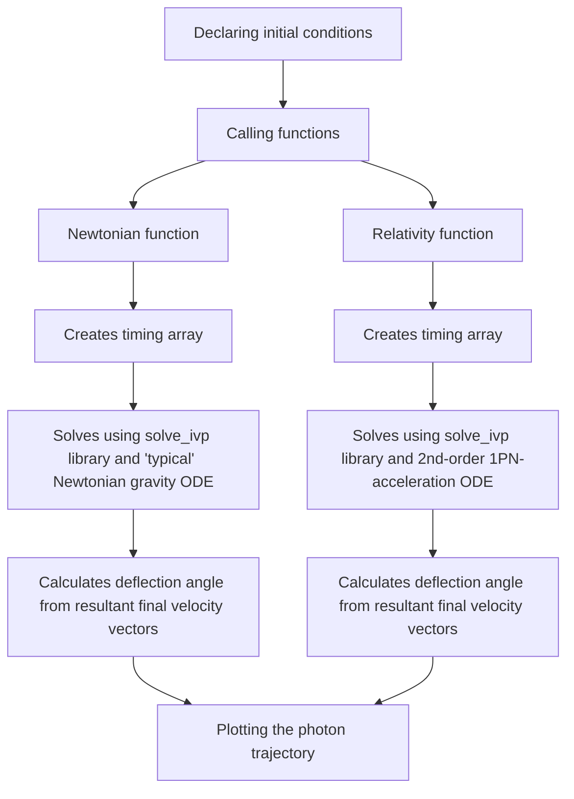

---
    Author: Ethan White
    Project: Project 5, Starlight Bending
    Date: 5/7/2025
    Class: PHYS 4130, General Relativity Spring 2025
---

# Introduction

The geodesic equation in General Relativity is a tool which can be used towards plotting geodesics (straight lines on a curved space, like spacetime) of particles around a gravitational source with a given metric. The given metric that we will be working with is the spherical polar version of the linearized Schwarzschild weak field limit metric. It can be expressed as the following matrix (but it is a tensor, not a matrix, just to be clear):

$$
g_{\mu\nu}=
\begin{pmatrix}
-1+\frac{2GM}{c^2r} & 0 & 0 & 0 \\
0 & (1-\frac{2GM}{c^2r})^{-1} & 0 & 0 \\
0 & 0 & (1-\frac{2GM}{c^2r})^{-1} & 0 \\
0 & 0 & 0 & (1-\frac{2GM}{c^2r})^{-1}
\end{pmatrix}=
\begin{pmatrix}
-1+\frac{2GM}{r} & 0 & 0 & 0 \\
0 & (1-\frac{2GM}{c^2r})^{-1} & 0 & 0 \\
0 & 0 & r^2 & 0 \\
0 & 0 & 0 & r^2\sin^2\theta
\end{pmatrix}
$$

Furthermore, the geodesic equation that we will be working with is given by:

$$
\frac{\partial^2 x^{\mu}}{\partial s^2}+\Gamma^{\mu}_{\alpha\beta}\frac{\partial x^\alpha}{\partial s}\frac{\partial x^\beta}{\partial s}=0
$$

It is incredibly important to notice that this is not just one equation (even though it is *the* geodesic equation). Since we are working in 4-dimensional spacetime, $\mu, \alpha, \beta \in \{0, 1, 2, 3\}$

Thus, there are, at first glance, **64 different PDEs**. However, by examining the symmetry of the metric (specifically, that it is diagonal), the equation reduces significantly. You may be asking yourself-- "what is $\Gamma^{\mu}_{\alpha \beta}$?". This symbol, the Christoffel symbol, represents the curvature of spacetime around the 'basis vectors' of space-time itself (coordinates (1, 2, 3) and time (0) and whatnot). This value can be calculated two ways:

$$ 
\Gamma^\mu_{\alpha \beta} = \frac{1}{2} g^{\mu \nu} \left( \partial_\alpha g_{\beta \nu} + \partial_\beta g_{\alpha \nu} - \partial_\nu g_{\alpha \beta} \right) = \frac{\partial^2 x^\gamma}{\partial x^{\alpha} \partial x^{\beta}} \frac{\partial x^{\mu}}{\partial x^\gamma}
$$

It is most useful to look at the first equation with our metric, since everything can be calculated by hand pretty easily-ish.

> [!NOTE]
> In the end, I did not use the geodesic equations to actually solve for anything. I used a line element method and looked at conserved quantities. But, I wanted to keep this little geodesic equation explanation in here since it took a long time to type and I am proud of it and I feel like my classmates may learn something from it. 

<figure>
  
  <figcaption> [1] Starlight bending figure.
</figcaption>
</figure>

&nbsp;
 

The bending of starlight can be explained by the above cartoon. The 'star light' (light from another star) bends around our sun, such that there is some angle between the initial paths tangent vector and the post-sun-skimming tangent vector (should be precisely 1.75 arcseconds). This phenomenon is also known as gravitational lensing and can be used towards seeing far-away galaxies that may be concealed by other galaxies. 

This phenomenon is particularly interesting because in Newtonian physics, the resulting angle is off by a factor of two compared to the general-relativistic prediction. This gravitational lensing effect was critical towards proving Einstein's theory of general relativity, and once observations made by Sir Arthur Eddington on an expedition in 1919 during a total solar eclipsde were made, Einstein's fame skyrocketed.

# Purpose

The purpose of this project is to combine both general relativity and computational physics by computing the exact angle of starlight bend, and to compare this value with Newtonian predictions. 

# Procedure / Algorithm

> [!IMPORTANT]
> This is the only way that I could figure out a program that would replicate the starlight bend of ~1.75 arcseconds. It feels wrong to use because, in the end, all I added was a correction term for our acceleration (which did get the right answer).

For this program to be efficient, it may be good for us to briefly cover how the Newtonian angle calculation goes, and why it's wrong by a factor of two compared to the GR approach. After this brief calculation, I will calculate the GR deflection angle. Finally, I will go through the THICK derivation of the 'correction factor' approach I implemented to solving my problem. Then, I will explain relevant algorithms/the code itself.

## Newtonian Deflection Angle

I do not have time to write all of this down, but the final answer through a Newtonian calculation is:

$$
\Delta\theta=\frac{2GM}{c^2b} 
$$

where b is the impact parameter (for grazing the sun's surface, b is the radius of the sun, so substituting that into the equation yields us the numerical value of 0.86 arcseconds.

## Relativity Deflection Angle

This derivation uses a lot more work than the previous one, and for the sake of time, I will just claim that (with b as our impact parameter), our deflection angle is doubled to 1.72 arcseconds:

$$
\Delta\theta=\frac{4GM}{c^2b}
$$

This is the experimental value Eddington found in 1919!

## Photon Trajectory Derivation

We start with our Schwarzchild line element:

$$
ds^2=g_{\alpha\beta}dx^{\alpha}dx^{\beta}=-(1-\frac{2GM}{c^2r}) c^2dt^2+(1-\frac{2GM}{c^2r}) ^{-1}dr^2+r^2d\theta^2+r^2\sin^2\theta d\phi^2
$$

Now, since we will be working with a photon, $ds^2=0$. Furthermore, since this is a symmetric sort of situation, we only need to work in the $\theta=\frac{\pi}{2}$ plane, and thus d$\theta=0$. We can choose $\lambda$ to be our affine parameter. Putting all of this together, our line element becomes:

$$
0=-(1-\frac{2GM}{c^2r})c^2(\frac{dt}{d\lambda})^2+(1-\frac{2GM}{c^2r})^{-1}(\frac{dr}{d\lambda})^2+(r\frac{d\phi}{d\lambda})^2
$$

It is VERY useful to use (exploit) conserved quantities, particularly energy and angular momentum, which in our case are defined by:

$$
E = (1-\frac{2GM}{c^2r})c^2(\frac{dt}{d\lambda})
L = r^2\frac{d\phi}{d\lambda}
$$

Substituting these values into our null condition line element, we get that:

$$
0=-(1-\frac{2GM}{c^2r})^{-1}\frac{E^2}{c^2}+1-\frac{2GM}{c^2r})^{-1}(\frac{dr}{d\lambda})^2+\frac{L^2}{r^2}
$$

Multiplying through by $-(1-\frac{2GM}{c^2r})^{-1}$, we get that, after rearranging and solving for $\frac{dr}{d\lambda}$:

$$
(\frac{dr}{d\lambda})^2=\frac{E^2}{c^2}-(1-\frac{2GM}{c^2r})\frac{L^2}{r^2}
$$

Now, we need to make a substitution of $u=1/r$, which leads to $\frac{du}{d\lambda}=\frac{-1}{r^2}\frac{du}{d\lambda}$. Also, we must reparameterize and have $\phi$ be our independent variable. Then, by the Chain rule, we have that $\frac{dr}{d\lambda}=\frac{L}{r^2}\frac{dr}{d\phi}$. Then, expressing our equation in terms of u-stuff, we have that:

$$
(\frac{du}{d\phi})^2=\frac{1}{L^2}(\frac{E^2}{c^2}-L^2u^2+\frac{2GML^2}{c^2}u^3)
$$

Now, if we differentiate both sides with respect to $\phi$ and use chain rule again, we have that:

$$
2\frac{du}{d\phi}\frac{d^2u}{d\phi^2}=-2u\frac{du}{d\phi}+\frac{6GM}{c^2}u^2\frac{du}{d\phi}
$$

which implies that, after dividing by 2 and $\frac{du}{d\phi}$, that we have our really important equation that defines our photon geodesic:

$$
\frac{d^2u}{d\phi^2}+u=\frac{3GM}{c^2}u^2
$$

Let's look at this equation. The left hand side represents the central acceleration of particles inwards in Newtonian gravity. The right hand side is a 'correction factor' term that spawns from the GR approach. From 1PN (Post-Newtonian) approximation, we have that our GR acceleration term has an additional factor of $v_r^2$ on it, so our total acceleration is determined by (with $\delta$ representing the correction factor):

$$
a=a_{newtonian}(1+\delta_{rcf}v^2). 
$$

Since we want to look at radial velocity, we have that, since $r\cdot v_r = rv_r$, $v_r = \frac{r\cdot v_r}{r}$. Then, since we know acceleration in Newtonian gravity is just $a=-\frac{GM}{r^2}$, we have our FULL acceleration formula is:

$$
\mathbf{a}=-\frac{GM}{r^2}(1+\frac{3GM(r\cdot v_r)^2}{c^2r^2})
$$

We can dot this into the $a_x$ or $a_y$ directions just by scaling by $\frac{x}{r}$ or ${y}{r}$ (just a cosine or sine). Thus, we have, in the end, derived a useful correction factor using 1PN approximations and the line element of the Schwarzchild geodesic.

## Relevant Algorithms

The following mermaid diagram helps explain exactly what I did:

The only major difference between the two functions that calculate the trajectories is the correction factor within the actual ODEs themselves. Otherwise, they are pretty much the same function.

# Results / Discussion

<figure>
  
  <figcaption> [1] Graphic of the photon path trajectories. It isn't that helpful since they overlap becaues the distances are massive LOL. But, numerically, they are correct.
</figcaption>
</figure>

&nbsp;
 

From the graph

# Project Goals (submitted Apr 24th)

The goals of this project are to:

1. Computatinally model the bending of starlight around the sun and compare this resulting angle with observational data (bend angle of 1.75 arcseconds). (18% of final grade in GR course).

This will be done by using the Schwarzchild metric, computing the Christoffel symbols, and using the geodesic equation. The actual computational side of this will be SOLVING this system of coupled PDEs using a higher order sympletic integrator. 

2. If possible, as an extension, model the perihelion advance of Mercury. (2% of final grade in GR course)
